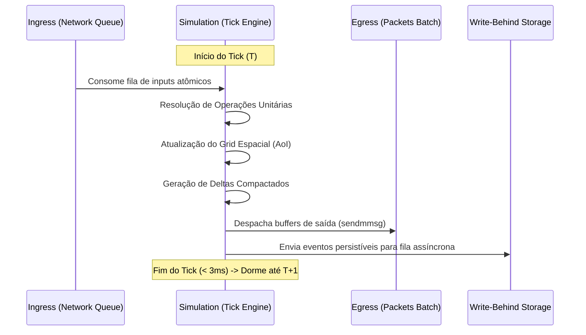
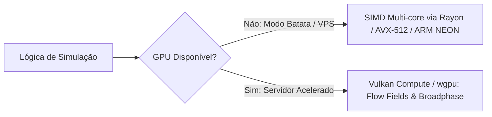

# Hades Engine — Documento de Arquitetura Técnica

> **Versão:** 0.1.0-draft  
> **Status:** Brainstorm & Especificação de Design  
> **Alvo:** Motor de MMORPGs 2D/2.5D de alta densidade em Rust

---

## 1. Princípios Fundamentais de Design

O Hades baseia-se em quatro pilares conceituais:

1. **Economia Espacial e Computacional:** Inspirado nas análises do *YggEngine*, o motor não simula o que ninguém está vendo e não envia dados que não mudaram.
2. **Separação Rígida entre Simulação e I/O:** O loop de simulação de tick é estritamente *in-memory* e determinístico. Nenhuma operação de rede, disco ou lock concorrente bloqueia o tick.
3. **Hardware Agnostic com Degradação Graciosa:** Capaz de rodar num único núcleo ARM64 ou x86_64 modesto com menos de 50MB de RAM, mas preparado para delegar cálculos massivos (como navegação de 50k monstros) para GPUs via Vulkan Compute (`wgpu`) quando presentes.
4. **Protocolo Unificado Web + Desktop:** Uso de **WebTransport (sobre HTTP/3 / QUIC)** como padrão único, permitindo que clientes nativos (Godot/Unity/Rust) e navegadores (WebAssembly/WebGPU) utilizem exatamente a mesma pilha de pacotes.

---

## 2. A Camada de Transporte e Rede

### 2.1 WebTransport & QUIC vs. Legado TCP
Os emuladores clássicos (rAthena, OpenTibia) foram projetados em TCP cru, sofrendo com **Head-of-Line (HoL) Blocking**: quando um único pacote de movimento é perdido em uma rota congestionada, toda a fila do TCP congela até a retransmissão.

O Hades adota canais desacoplados:
* **Datagramas Não-Confiáveis (Unreliable Datagrams):** Para posições de entidades, direção, pings e inputs contínuos. Perdas são descartadas; o próximo tick envia o estado mais recente.
* **Streams Bidirecionais Confiáveis (Reliable Streams):** Para login, troca de itens (trade), compras em NPCs, mensagens de chat e mudanças permanentes de inventário.

```
+-------------------------------------------------------------+
|                 Hades Network Transport                     |
|                                                             |
|   +-----------------------+     +-----------------------+   |
|   |   Reliable Streams    |     | Unreliable Datagrams  |   |
|   | (Chat, Trade, Auth)   |     |  (Movement, Combat)   |   |
|   +-----------------------+     +-----------------------+   |
|               |                             |               |
|               v                             v               |
|         HTTP/3 / QUIC (WebTransport / Quinn Engine)         |
+-------------------------------------------------------------+
```

### 2.2 Batching de Syscalls (`sendmmsg` e `io_uring`)
Para evitar tempestades de chamadas de sistema (*context switch storms*) em CPUs modestas:
* Ao final de cada tick, os pacotes destinados a centenas de jogadores são consolidados em um buffer linear contíguo.
* Um único comando `sendmmsg` (no Linux) entrega centenas de datagramas UDP para a pilha de rede do kernel em uma única transição de contexto.

### 2.3 Bitpacking & Formato de Mensagens
Evita-se JSON ou XML no protocolo de gameplay. Usa-se serialização binária com bitpacking:

```
[ Exemplo de Delta de Movimento - Total: 6 Bytes ]
| Entity ID (16 bits) | PosX (12 bits) | PosY (12 bits) | Dir/Action (8 bits) |
```

---

## 3. O Loop de Simulação e Operações Unitárias

### 3.1 O Ciclo de Ticks (Pipeline Desacoplado)
O servidor opera em uma frequência fixa de **15 Hz a 20 Hz** (50ms a 66ms por tick). Cada tick segue uma esteira sem bloqueios:



### 3.2 Operações Unitárias
Toda ação no jogo é tratada como uma transição pura:
$$\text{Estado}(t) + \text{Ação/Input} \rightarrow \text{Estado}(t+1) + \Delta\text{Eventos}$$

Nenhuma lógica de monstro acessa banco de dados, cria threads ou faz cálculos de rede dentro do processamento de regras.

---

## 4. Particionamento Espacial e Gestão de Interesse (AoI)

### 4.1 Grid Bucketing $O(1)$
O mundo 2D/2.5D é segmentado em células quadradas de tamanho fixo (ex: $32 \times 32$ tiles):
* Cada célula mantém uma lista compacta de IDs de entidades residentes.
* Quando uma entidade se move entre células, apenas remove seu ID da lista antiga e insere na nova ($O(1)$).
* Jogadores registram interesse na célula atual e nas 8 células vizinhas (raio $3 \times 3$).

```
+----------+----------+----------+
| Célula 1 | Célula 2 | Célula 3 |
+----------+----------+----------+
| Célula 4 | Jogador  | Célula 6 |  --> Área de Interesse (AoI)
+----------+----------+----------+      9 células consultadas em O(1)
| Célula 7 | Célula 8 | Célula 9 |
+----------+----------+----------+
```

### 4.2 Spatial Level of Detail (LOD) & Hibernação
* **Tier 0 (Alta Prioridade - 20 Hz):** Células ocupadas por pelo menos um jogador humano. Mobs e projéteis simulam com precisão total.
* **Tier 1 (Média Prioridade - 5 Hz):** Células adjacentes distantes. Simulação reduzida e interpolação no cliente.
* **Tier 2 (Hibernação - 0.1 Hz ou Dormindo):** Setores vazios. Nenhum ciclo de CPU é gasto com IA de monstros. Seus status só são atualizados de forma retroativa quando um jogador se aproxima.

---

## 5. Escalabilidade de Hardware: Do "Modo Batata" à Aceleração por GPU

O Hades implementa um padrão de **computação adaptativa**:



### 5.1 Onde a GPU é Usada:
* **Flow Fields para Pathfinding Massivo:** Em guerras ou eventos com milhares de entidades perseguindo poucos alvos, o mapa de vetores da área é computado em um único *Compute Shader* e compartilhado entre todos os monstros.
* **Detecção de Colisão em Lote (Broadphase 2D):** Aceleração de milhares de projéteis e círculos de hitbox simultâneos.

### 5.2 IA Local (Anti-Cheat & NPCs):
* Utilização de runtimes embarcados como **ONNX Runtime** ou **Tract/Burn** em Rust puro para inferência de modelos leves de detecção de bots e comportamento tático sem depender de APIs externas.

---

## 6. Persistência de Dados (In-Memory First + Write-Behind)

1. **Estado Vivo em RAM:** O estado ativo de jogadores, monstros e mapas reside 100% na memória RAM através de estruturas contíguas pré-alocadas (`SlotMap`).
2. **Fila Assíncrona de Persistência:** Alterações permanentes (XP ganho, itens obtidos, logs de transação) são enfileiradas em um canal MPSC (*Multi-Producer Single-Consumer*).
3. **Worker de Banco de Dados:** Uma thread separada drena a fila e executa transações em lote no **SQLite em modo WAL** (ou Postgres/ScyllaDB em clusters maiores), garantindo que picos de disco nunca causem travamentos no jogo.
