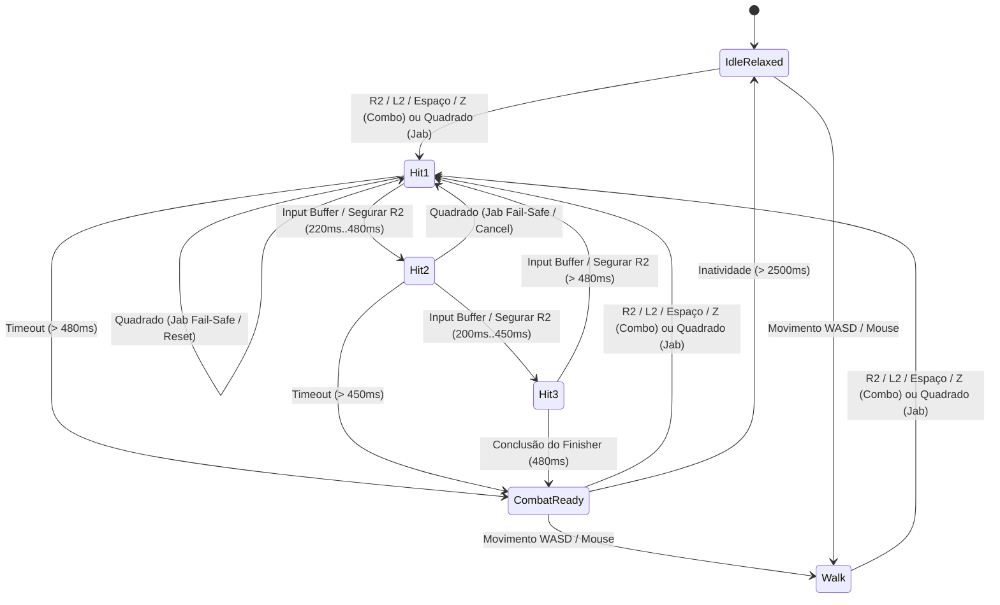

# SPEC-0021: Cadência Fixa, Encadeamento de Combos Rítmicos e Feedback Visual de Combate

## 1. Contexto e Filosofia de Design

Nos sistemas legados de MMORPGs 2.5D, a velocidade de ataque (ASPD) frequentemente escalava até extremos matemáticos (ex: ASPD 190 = 5 ataques por segundo), transformando animações clássicas detalhadas em sequências truncadas, ilegíveis e sem impacto tátil ("efeito liquidificador").

O **Projeto Hades** adota uma abordagem moderna inspirada em *Action-RPGs* rítmicos:
1. **Preservação do Game Feel:** Cada golpe mantém duração e peso legíveis (~360ms a 480ms), com fases claras de preparação (*wind-up*), impacto (*slash/hit*) e recuperação (*follow-through*).
2. **Encadeamento de Combos (Combo String):** Em vez de acelerar cegamente a animação de um único golpe, o combate premia a cadência rítmica através de uma cadeia de golpes encadeados:
   - **Golpe 1 (Overhead Slash / Jab):** Corte descendente clássico (Ação 80).
   - **Golpe 2 (Cross Slash / Backhand):** Corte transversal de retorno (espelhamento horizontal da lâmina e recuperação rápida).
   - **Golpe 3 (Heavy Finisher):** Golpe concentrado finalizador com impacto estendido.
3. **Buffer de Entrada (Input Buffering) & Tolerância de Timing:**
   - Para perdoar pequenos erros de precisão motora (timing imperdoável), inputs antecipados em até 280ms são armazenados em um *Input Buffer* na pilha.
   - Assim que a janela do estágio abre (`min_w`), o buffer é consumido imediatamente, transitando sem atraso percebido nem inputs descartados.
4. **Cadência Contínua ao Segurar (Hold-to-Repeat):**
   - Segurar o gatilho principal de ataque (R2 / L2 no controle ou Barra de Espaço / Z no teclado) encadeia automaticamente a sequência de combos no timing ótimo (`Hit 1 -> Hit 2 -> Hit 3 -> Hit 1...`), eliminando fadiga por esmagamento de botões (*button mashing*).
5. **Mapeamento de Controles e Golpes:**
   - **Gatilhos (R2 / L2) & Espaço / Z:** Ataque normal encadeado (Combo String completa) com suporte a segurar contínuo.
   - **Quadrado (`Button::West`):** *Fail-safe* dedicado para Jabs rápidos (Hit 1 seguro com recuperação acelerada e buffer de entrada), permitindo interrupções seguras sem se comprometer com a finalização pesada.
6. **Potato Budget:** Zero alocações na heap durante a execução de ciclos de combo e buffers a 60 FPS.

---

## 2. Máquina de Estados de Combate

---

## 3. Especificação dos Estágios de Combo

| Estágio | Ação Base | Duração | Janela de Encadeamento | Variação Visual | Multiplicador de Dano |
| :--- | :--- | :--- | :--- | :--- | :--- |
| **Hit 1 (Abertura / Jab)** | Ação 80 + `act_dir` | 540 ms | 340 ms .. 650 ms | Corte descendente padrão (1.5x speed, 9 quadros) | 1.0x |
| **Hit 2 (Retorno)** | Ação 80 + `act_dir` | 480 ms | 300 ms .. 600 ms | Corte transversal de retorno (*inverted slash*, 1.65x) | 1.15x |
| **Hit 3 (Finalizador)** | Ação 80 + `act_dir` | 720 ms | Fim do golpe (720 ms) | Impacto concentrado pesado e clímax (1.25x) | 1.50x |

---

## 4. Ordem Z e Sincronização de Camadas

A cadeia de combos utiliza a mesma infraestrutura multi-camada do **SPEC-0020**:
- Sombra $\rightarrow$ Corpo $\rightarrow$ Cabeça $\rightarrow$ Elmo $\rightarrow$ Arma (com inversão Z para direções traseiras 3, 4, 5).
- Os pontos de fixação (`AttachPoint`) ajustam a cabeça e o elmo a cada quadro de acordo com a torção e recuo do corpo.
- No `Hit 2`, o espelhamento horizontal (`flip_h: true`) inverte o eixo X relativo e espelha os sprites de todas as camadas.

---

## 5. Critérios de Aceite e Testes Unitários

1. **`test_combo_state_transitions_and_rhythmic_timing_window`:**
   - Valida que inputs dentro da janela avançam `Hit 1` $\rightarrow$ `Hit 2` $\rightarrow$ `Hit 3`.
   - Valida que inputs antecipados são retidos pelo buffer de entrada e consumidos quando a janela abre.
2. **`test_hold_to_repeat_combo_chain`:**
   - Valida que segurar o botão de combo transita continuamente através de `Hit 1 -> Hit 2 -> Hit 3 -> Hit 1`.
3. **`test_quadrado_failsafe_jab`:**
   - Valida que o botão de jab (Quadrado) sempre aciona ou reseta para o Hit 1 seguro com buffer perdoador.
4. **`test_combat_ready_and_idle_decay`:**
   - Valida transição para postura de guarda após término de combo e retorno a repouso após 2,5s sem input.
