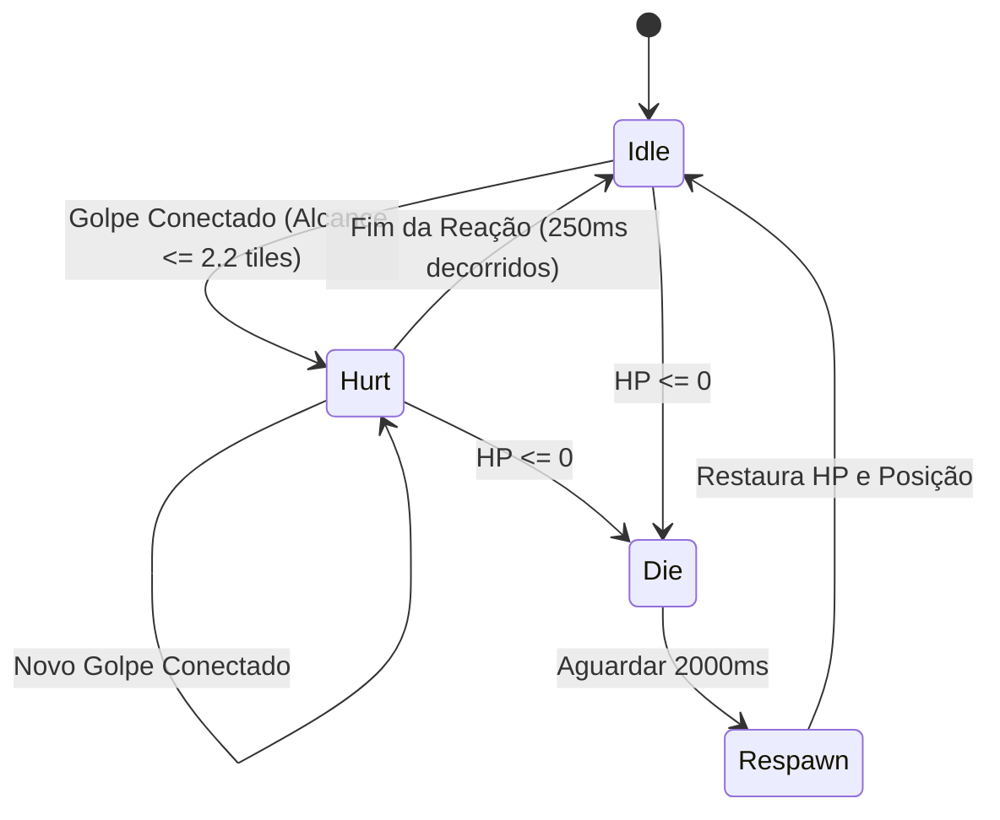

# SPEC-0022: Entidade de Treino Gelatinosa, Feedback de Impacto e Combate Físico em Tempo Real

## 1. Contexto e Filosofia de Design

Para validar interativamente o sistema de combos, cadência rítmica e tolerância de entrada (SPEC-0021), o cliente **Berenice** e a engine **Hades** necessitam de uma entidade alvo reativa no mundo (*Training Dummy*).

Seguindo a política de discrição técnica e terminologia limpa (*Clean-room*), implementa-se um monstro de treino gelatinoso e saltitante (*Bouncy Slime Dummy*):
1. **Feedback Visual Imediato:** Cada golpe da cadeia de combos (Hit 1, Hit 2, Finisher Hit 3 e Jab) gera reação física visível no alvo:
   - Transição imediata para animação de impacto (*Hurt*).
   - Recuo sutil (*knockback*) no finalizador pesado.
   - Textos de combate flutuantes com valores numéricos de dano (*Floating Damage Numbers*).
   - Barra de vida (*HP Bar*) flutuante responsiva.
2. **Ciclo de Animação Canônico do Monstro:**
   - **Idle (Ações 00..07):** Salto gelatinoso relaxado de 4 quadros.
   - **Hurt (Ações 24..31):** Compressão elástica e achatamento por impacto de 5 quadros.
   - **Die (Ações 32..39):** Dissolução / estouro aquoso de 17 quadros ao zerar HP, seguido de *respawn* automático após 2,0s.
3. **Potato Budget:**
   - Gerenciamento de números de dano flutuantes e estado da entidade em *buffer* de capacidade fixa na pilha (`[FloatingText; 8]`). Zero alocações na heap a 60 FPS.

---

## 2. Máquina de Estados da Entidade Alvo

---

## 3. Resolução de Combate Corpo-a-Corpo

| Ação do Jogador | Dano Base | Multiplicador | Reação do Alvo | Cor do Dano |
| :--- | :--- | :--- | :--- | :--- |
| **Hit 1 (Abertura)** | 12 DMG | 1.0x | Hurt (Compressão elástica) | Amarelo (`0xFFF1FA8C`) |
| **Hit 2 (Retorno Invertido)** | 15 DMG | 1.15x | Hurt (Impacto rápido) | Dourado (`0xFFFFB86C`) |
| **Hit 3 (Finalizador Pesado)** | 24 DMG | 1.50x | Hurt + Recuo / Knockback | Vermelho Crítico (`0xFFFF5555`) |
| **Jab Fail-Safe (Quadrado/X)** | 10 DMG | 0.85x | Hurt rápido | Ciano Claro (`0xFF8BE9FD`) |

---

## 4. Textos Flutuantes de Dano (Floating Combat Text)

A renderização na *Software Framebuffer* projeta o dano no espaço de tela:
- Cada número flutuante possui: `(x, y, valor, cor, timer_ms, max_ttl_ms)`.
- A cada quadro: $y \leftarrow y - 0.75 \times \text{speed}$; $timer \leftarrow timer + dt$.
- Desaparece suavemente ao atingir 600 ms.

---

## 5. Critérios de Aceite e Testes Unitários

1. **`test_training_dummy_hit_resolution_and_damage`:**
   - Valida que golpes dentro do alcance ($\le 2$ tiles) reduzem o HP e ativam o estado *Hurt*.
   - Valida que o dano respeita os multiplicadores dos estágios do combo.
2. **`test_training_dummy_death_and_respawn_cycle`:**
   - Valida transição para estado *Die* ao atingir 0 HP e restauração automática com HP total após 2s.
3. **`test_floating_damage_buffer_zero_allocations`:**
   - Valida fila circular de números flutuantes sem exceder o limite estático nem alocar dinamicamente na heap.
