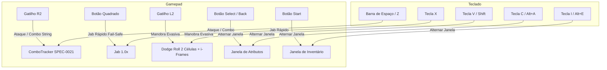

# SPEC-0023: Movimento Evasivo (L2), Barras de Status (HP/SP) e Janelas de Atributos e Inventário

## 1. Contexto e Filosofia de Design

Para elevar o cliente **Berenice** e a engine **Hades** ao patamar de jogabilidade responsiva e completa de um MMORPG 2.5D clássico com controles modernos:
1. **Movimento Evasivo Dedicado (L2 / Esquiva):**
   - O gatilho **L2** (`Button::LeftTrigger2` no controle ou tecla `Espaço/Shift/V` no teclado) é desacoplado do ataque e passa a acionar uma manobra evasiva rápida (*Dodge Roll / Dash* de 2 células).
   - Concede *i-frames* (260 ms de invulnerabilidade), consome uma pequena fração de SP (4 SP) e respeita as células de colisão transitáveis da malha `.gat`.
2. **Painel de Status do Jogador (HP & SP Bars):**
   - Exibição canônica no HUD com barras de preenchimento proporcional:
     - **HP (Pontos de Vida):** Barra verde/vermelha com valor numérico e percentual.
     - **SP (Pontos de Mana/Espírito):** Barra azul ciano/índigo com valor numérico.
     - Regeneração natural periódica baseada nos atributos clássicos (VIT para HP, INT para SP).
3. **Janela de Atributos Clássica (Status Window - Tecla C / Select):**
   - Interface translúcida exibindo os 6 atributos base (*STR, AGI, VIT, INT, DEX, LUK*) e os atributos derivados (*ATK, DEF, MATK, MDEF, HIT, FLEE, CRIT, ASPD*), integrados com o módulo `hades-ro-prere::stats`.
4. **Janela de Inventário e Capacidade de Peso (Inventory Window - Tecla I / Start):**
   - Interface em grade exibindo itens em posse (*Red Potion, Blue Potion, Jellopy, etc.*), quantidade e peso acumulado em relação à capacidade máxima (*Weight Limit*).
5. **Potato Budget:**
   - Zero alocações na heap a cada frame de renderização a 60 FPS.

---

## 2. Diagrama de Controle e Mapeamento de Entradas

---

## 3. Especificação da Manobra Evasiva (Dodge Dash)

| Parâmetro | Valor | Descrição |
| :--- | :--- | :--- |
| **Gatilho Principal** | L2 (`LeftTrigger2` / `LeftTrigger`) | Acionamento imediato |
| **Teclado** | Tecla `V` ou `Shift` com Direção | Suporte ergonômico |
| **Distância do Deslocamento** | 2 células | Direção do movimento atual ou oposta ao facing |
| **Custo de SP** | 4 SP | Consumido se disponível |
| **Tempo de Recarga (Cooldown)** | 650 ms | Evita spam ininterrupto |
| **Duração do Dash** | 180 ms | Translação suave a alta velocidade |
| **Quadros de Invulnerabilidade (i-frames)** | 260 ms | Dano recebido é mitigado |

---

## 4. Estrutura do HUD e Janelas Flutuantes

### 4.1. Painel de Vida e Mana (Player Status Frame)
- Dimensões: $180 \times 44$ pixels.
- Barra de HP: $120 \times 8$ px (`0xFF50FA7B` / `0xFFFF5555`).
- Barra de SP: $120 \times 8$ px (`0xFF8BE9FD` / `0xFF6272A4`).

### 4.2. Janela de Atributos (Status Window)
- Alternável com tecla `C` ou clique.
- Exibe:
  - Base Level, Job Level, Nome da Classe.
  - Atributos Base: STR, AGI, VIT, INT, DEX, LUK.
  - Atributos de Batalha: ATK, DEF, MATK, MDEF, HIT, FLEE, CRIT, ASPD.

### 4.3. Janela de Inventário (Inventory Window)
- Alternável com tecla `I` ou clique.
- Exibe grade de itens com ícones/nomes, quantidade empilhada e medidor de peso total (`120 / 2200`).

---

## 5. Critérios de Aceite e Testes Unitários

1. **`test_evasive_dodge_maneuver_displacement_and_cooldown`:**
   - Valida que acionar a manobra desloca a posição em 2 células válidas na malha andável e respeita o cooldown de 650ms.
2. **`test_player_hud_hp_sp_ratio_and_regen`:**
   - Valida cálculo e decaimento correto de HP/SP e regeneração periódica.
3. **`test_status_and_inventory_windows_toggle`:**
   - Valida alternância de visibilidade das janelas por atalhos sem alocações dinâmicas na renderização.
